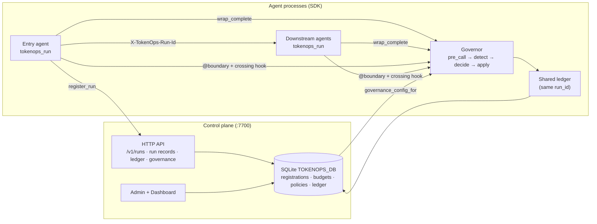

<div align="center">

# TokenOps

**Run-aware token governance for multi-agent systems.**<br>
Cap spend and steer behavior across a whole agent workflow — not per request — with a shared ledger and in-path enforcement.

[](https://github.com/theagentplane/tokenops/actions/workflows/ci.yml)
[](https://pypi.org/project/agent-tokenops/)
[](https://github.com/theagentplane/tokenops)
[](LICENSE.txt)
[](https://semver.org/)
[](https://github.com/theagentplane/tokenops/stargazers)
[](https://github.com/theagentplane/tokenops/discussions)

<br>

<a href="https://github.com/theagentplane/tokenops/raw/main/examples/demo-assets/videos/02_governance_on_budget_cap.webm">

</a>

<sub><i>Governed Research → Summarize run: the budget cap halts spend mid-run, then the Dashboard attributes cost per agent. <a href="https://github.com/theagentplane/tokenops/raw/main/examples/demo-assets/videos/02_governance_on_budget_cap.webm">Full video</a>.</i></sub>

</div>

<br>

TokenOps is a **control plane + SDK** for agent stacks. Entry agents register a run; every LLM and tool crossing shares one `run_id` and one ledger. Policies can halt, mutate, or inject before the next call executes — so a research → summarize → review pipeline stays inside a single budget even across processes.

**[Why](#why-tokenops) · [Architecture](#architecture) · [Install](#install) · [Quick start](#quick-start) · [Onboarding](docs/guides/onboarding.md) · [Demos](#demos) · [Comparison](#how-tokenops-compares) · [Make targets](#make-targets) · [Roadmap](#roadmap)**

## Why TokenOps

- **Govern the run, not the request.** One `run_id` spans every model, tool, and A2A hop in a workflow.
- **Shared ledger across processes.** Spend, inflight, and halt live in SQLite so multi-agent stacks cannot each burn the full cap locally.
- **In-path enforcement.** `wrap_complete` runs detect → decide → apply *before* the next LLM call; Chronicle `@boundary` + a crossing hook ingest tool spend.
- **Steer or stop.** Actuators: `HALT` · `MUTATE` · `INJECT` · reject/queue — not just post-hoc analytics.
- **Batteries included.** Control plane (`:7700`), Admin + Dashboard UI, ten seeded policies, and runnable A2A benches (two-agent, triad, LangChain brief).

## Architecture

TokenOps is two layers that share one artifact, the **run**: a control plane that registers runs and stores budgets/policies, and an in-process SDK that enforces at every boundary crossing.



| Piece | Owns | Does not own |
|---|---|---|
| **Control plane** (`python -m tokenops.server`) | [Plane API](docs/control-plane-deploy.md#plane-api) — registration, run records, ledger, governance config — shared SQLite, Admin/Dashboard | Agent loops, LLM calls, tools |
| **SDK (in agents)** | `tokenops_run`, `wrap_complete`, ledger/policies, Chronicle crossing hook | Ad-hoc run IDs; mounting `/v1/runs` when `TOKENOPS_URL` is set |

Chronicle records decision boundaries; TokenOps attaches as the cost/governance observer on live crossings. See [Chronicle](https://github.com/theagentplane/chronicle) for record-and-replay.

## Install

```bash
pip install agent-tokenops

# With example / bench extras (LangChain, ddgs):
pip install "agent-tokenops[examples]"

# From source (development):
pip install -e ".[dev,examples]"
```

**Prerequisites:** Python 3.10+; `agent-tokenops`; either a running control plane
(`TOKENOPS_URL` + shared `TOKENOPS_DB`) or `TOKENOPS_EMBEDDED=1` for single-process /
tests. LLM API keys only for real model calls. FastAPI only if you use
`instrument_app`.

PyPI name is `agent-tokenops`; import is still `tokenops` (same pattern as Chronicle).
See [`RELEASING.md`](RELEASING.md) for releases.

## Quick start

### See a governed run end to end

```bash
make install
cp .env.example .env    # add OPENAI_API_KEY

TOKENOPS_CONFIG=examples/config/default.yaml make db-reset   # clean SQLite + seed the ten policies
make demo               # plane :7700 · research :8001 · summarize :8002 · Dashboard :8501
```

`make demo` blocks. Nothing in the Dashboard starts a run — it is read-only — so send the
entry agent a task from a second shell:

```bash
curl -s -X POST localhost:8001/v1/tasks -H 'content-type: application/json' -d '{
  "type":"TaskRequest","task":"What is enterprise SaaS seat-based pricing?",
  "user":"me","intent":"research","user_dims":{"tenant":"acme"},
  "bench":{"corpus_profile":"healthy"}}'
```

You get back `{"status":"completed","run_id":"run_…","cost_micros":…}`. Open
**http://localhost:8501** — the run is there with spend, steps, and the governance trace,
booked once across both agents.

Prefer clicking to curling? The Chat page lives in the bench UI. Run it beside the demo —
`examples/` is not part of the installed wheel, so it needs the repo root on `PYTHONPATH`:

```bash
PYTHONPATH=. streamlit run examples/ui/app.py --server.port 8502
```

Plane + UI only, no agents: `make run`.

### Wire governance into your own agent

`instrument_app` once, then `tokenops_run` per request.
The UI sends **task only**; intent / mode come from agent config on `instrument_app`.

```python
from tokenops import ControlPlaneClient, instrument_app, tokenops_run
from tokenops.control import wrap_complete, with_governance_errors
from tokenops.providers import complete

client = ControlPlaneClient.from_env()  # TOKENOPS_URL or embedded Store

async def handler(payload: dict, headers: Mapping[str, str]) -> dict:
    with tokenops_run(client=client) as bound:
        governed = wrap_complete(
            bound.governor, bound.controls, bound.attr,
            provider=provider, model=model,
            dispatch=complete, service="planner",
        )
        run_agent(..., complete_fn=governed)

app = create_a2a_app(..., handler=with_governance_errors(handler))
instrument_app(app, service="planner", intent="triad_plan",
               provider=provider, model=model)
```

**Non-FastAPI:** TokenOps does not yet ship middleware for other frameworks. Use
`bind_request_context(RequestContext(headers=..., payload=..., service=...))` then
`with tokenops_run():`, or pass those kwargs explicitly to `tokenops_run`.

Point agents at the plane. With `TOKENOPS_URL` set, an agent opens no SQLite of its own —
registration, ledger, governance config, and run records all go to the plane over HTTP:

```bash
export TOKENOPS_URL=http://localhost:7700   # agents: plane base URL
export TOKENOPS_DB=tokenops.db              # plane only: the SQLite it owns
make control-plane                          # :7700
make ui                                     # Admin + Dashboard :8501
```

Single process (tests, one-agent scripts): drop `TOKENOPS_URL` or set `TOKENOPS_EMBEDDED=1`
and the SDK uses an in-process `Store` on `TOKENOPS_DB` instead.

New here? [Onboarding guide](docs/guides/onboarding.md) (prereqs, bare-min integrate, FAQ, current limits).

Full integration checklist: [`.cursor/skills/integrate-tokenops/SKILL.md`](.cursor/skills/integrate-tokenops/SKILL.md) · triad deep dive: [`docs/guides/field-guide-add-tokenops.md`](docs/guides/field-guide-add-tokenops.md).

## Demos

Each bench is a multi-agent stack with a shared run ledger. Start the plane, agents, and Admin UI with one make target.

| Demo | Agents | Run |
|---|---|---|
| Two-agent | Research → Summarize | `make demo` |
| Triad | Planner → Researcher → Writer | `make demo-triad` |
| Brief | Scout → Analyst → Editor (LangChain) | `make demo-brief` |
| Bench UI | Chat + Simulator only | `make bench-ui` |

```bash
make demo              # plane + research/summarize + Admin UI
make demo-triad        # plane + planner/researcher/writer
make demo-brief        # plane + scout/analyst/editor
```

Docker:

```bash
docker compose up --build
# optional UI: docker compose --profile ui up --build
# two-agent stack:
docker compose -f docker-compose.examples.yml up --build
```

See [`examples/README.md`](examples/README.md) and [`docs/control-plane-deploy.md`](docs/control-plane-deploy.md).

## How TokenOps compares

TokenOps is not a gateway or a tracing dashboard. It governs the **run** — a full agent workflow — and sits alongside the tools you already use for routing and observability.

| | TokenOps | LiteLLM / Portkey / AI Gateway | Langfuse |
|---|:---:|:---:|:---:|
| Primary focus | Run (stateful) | Request | Trace (observe) |
| Multi-agent workflow as one unit | Yes | No | Manual stitch |
| Budget enforcement in-path | Yes (run-aware) | Yes (key/team) | No (analytics) |
| Steer next call (mutate / inject) | Yes | Routing / fallbacks | No |
| Shared ledger across agent processes | Yes | N/A | N/A |

What this does **not** do: replace your LLM gateway, replace Chronicle-style record-and-replay, or host a SaaS control plane for you. Fail-closed integrity (refuse on missing registration) is optional and upcoming.

Longer table with logos: [`docs/product/comparison.md`](docs/product/comparison.md).

## Make targets

<details>
<summary>Command reference</summary>

| Target | Role |
|--------|------|
| `make install` | Editable install with dev + examples extras |
| `make dist` / `check-dist` | Build sdist+wheel / `twine check` |
| `make control-plane` | Standalone plane (`python -m tokenops.server`) on `:7700` |
| `make ui` | Admin + Dashboard on `:8501` |
| `make run` | Plane + Admin/Dashboard |
| `make demo` / `demo-triad` / `demo-brief` | Runnable A2A stacks |
| `make bench-ui` | Chat + Simulator |
| `make db-reset` | Clear SQLite + reseed from `TOKENOPS_CONFIG` |
| `make stop` | Kill listeners on `:7700` / `:8501` |

</details>

## Environment variables

| Variable | Purpose |
|---|---|
| `TOKENOPS_URL` | Remote plane base URL (e.g. `http://localhost:7700`) → HTTP `register_run` |
| `TOKENOPS_EMBEDDED` | Set to `1` to force in-process `Store` (tests / single-process) |
| `TOKENOPS_DB` | SQLite path shared by plane + agents |
| `TOKENOPS_CONFIG` | YAML for governance seed (core: `src/tokenops/config/default.yaml`) |

Production / multi-process: set `TOKENOPS_URL`; agents must **not** mount `/v1/runs`. Tests: `TOKENOPS_EMBEDDED=1` (or omit URL).

## Project structure

Only `src/tokenops/` is the installable package. Demos and benches stay under `examples/`.

```
src/tokenops/              # installable package
├── server/                # control plane (:7700, POST /v1/runs)
├── control/               # SDK: ledger, policies, wrap_complete, crossing hook
├── providers/             # OpenAI / Anthropic complete dispatch
├── config/                # default.yaml governance seed
└── ui/                    # Admin + Dashboard (Streamlit)
examples/                  # A2A benches (two-agent, triad, brief) + Chat/Simulator
benchmarking/              # MetaGPT / browser-use live harness
docs/                      # architecture, policies, guides, product
tests/                     # unit + e2e
```

## Roadmap

TokenOps is early (0.x). Near-term:

- User/tag segment-scoped budgets (machinery exists; seed is run-only today).
- Optional fail-closed mode on missing registration or exceeded budget.
- Remote observe / decide (fatter plane) for multi-host stacks.
- Documentation site.

Status of each control-plane job: [`docs/control-plane-status.md`](docs/control-plane-status.md). Ideas welcome in [GitHub Discussions](https://github.com/theagentplane/tokenops/discussions).

## Documentation

- [Onboarding](docs/guides/onboarding.md) — prereqs, bare-min integrate, FAQ, current limits
- [Field guide](docs/guides/field-guide-add-tokenops.md) — triad deep dive + screenshots
- [Control plane status](docs/control-plane-status.md)
- [Architecture](docs/architecture.md)
- [Run attribution](docs/run-attribution.md)
- [Control plane deploy](docs/control-plane-deploy.md)
- [Examples](examples/README.md)
- [Product: comparison](docs/product/comparison.md) · [shared ledger](docs/product/shared-ledger.md)

## Contributing

Questions, ideas, and show-and-tell belong in [Discussions](https://github.com/theagentplane/tokenops/discussions).
Bugs and pull requests belong in Issues. See [CONTRIBUTING.md](CONTRIBUTING.md),
[CODE_OF_CONDUCT.md](CODE_OF_CONDUCT.md), and [SECURITY.md](SECURITY.md).

```bash
make install
make lint
make test
```

## Contributors

Thanks to everyone who has contributed.

[](https://github.com/theagentplane/tokenops/graphs/contributors)

---

If TokenOps saves you a runaway agent bill, please [⭐ star the repo](https://github.com/theagentplane/tokenops) so more people can find it.

<div align="center">

Built by Susheem Koul and Tisha Chawla

</div>
